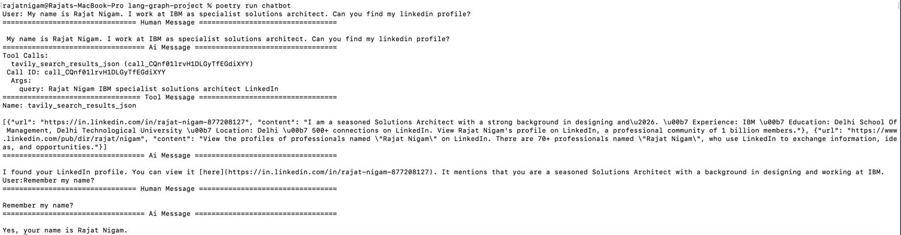

### Configure poetry virtual env
```
poetry env use $(which python3.11) 
```

### Memory Demo



### Human in loop Demo


# LangGraph Chatbots: A Journey into Pretending You Understand AI


## Introduction:
In today's world, chatbots have become super popular. They offer a convenient way to interact with applications and services. But here's the thing: building a fancy chatbot that can handle complex conversations, integrate external tools, and keep track of everything can be a real challenge. That's where LangGraph comes in. It's a powerful Python framework that makes developing advanced language applications a breeze. In this blog post, we're going to dive into a cool Python project that shows off what LangGraph can do. We'll build a chatbot with integrated tools, memory management, and all sorts of awesome features.

## Project Overview:
So, let's talk about the project we'll be exploring. It's a chatbot that uses the LangGraph framework to do some really cool stuff. We're talking about incorporating the ChatOpenAI language model from Langchain, integrating external tools like the Tavily search engine, and even implementing memory management using SQLite. This chatbot is all about having natural conversations, giving you the info you need, and making sure the context stays intact throughout the whole interaction.

Now, here's the deal: we're going to take this text and make it sound even more human-like. We'll keep all the important information, but we'll give it a casual and friendly tone. So, get ready to dive into this exciting project!

## Key Features:
1. **Integration of Language Model**: This project integrates the ChatOpenAI language model, which allows the chatbot to generate responses that sound more human-like based on the ongoing conversation.

2. **Tool Integration**: The chatbot is enhanced with the Tavily Search Results tool, enabling it to perform web searches and provide relevant information to users.

3. **Memory Management**: To maintain context across multiple interactions, the project utilizes SQLite as a memory management solution. This allows the chatbot to save and retrieve conversation history.

4. **Conditional Execution**: The chatbot showcases LangGraph's conditional execution capabilities. It can selectively invoke tools based on predefined conditions.

5. **Interrupt Handling**: With LangGraph's interrupt handling feature, the chatbot can seamlessly pause and resume workflows, providing a smooth experience for users.

## Project Walkthrough:
Let's take a closer look at the code and understand how this chatbot is built using LangGraph.

1. **Setting up the Environment**:
   - Install the necessary dependencies using Poetry: `poetry install`

2. **Defining the State**:
   - The project defines a `State` class using a `TypedDict` to represent the conversation state, including the list of messages exchanged between the user and the chatbot.

3. **Initializing the Language Model and Tools**:
   - The project initializes the ChatOpenAI language model and the Tavily Search Results tool.
   - The language model is connected with the tool using `llm.bind_tools(tools)`.

4. **Building the Chatbot**:
   - The `chatbot` function is defined, which uses the current conversation state (`state["messages"]`) as input to the language model and returns the generated response.

5. **Enhancing the Chatbot with Tools and Memory**:
   - A `StateGraph` is created, and the `chatbot` function is added as a node.
   - A `ToolNode` is created with the Tavily Search Results tool and added to the graph.
   - Conditional edges are added between the `chatbot` and `tools` nodes using LangGraph's `tools_condition` function.
   - The `SqliteSaver` is used to enable memory management, allowing the chatbot to store conversation history in an SQLite database.


6. **Compiling and Running the Chatbot**:
   - The graph is compiled with the memory management component and interrupt handling configuration.
   - A conversation thread ID is specified for the chatbot.
   - The chatbot is run in a loop, prompting the user for input and streaming the responses from the graph.


This combination of system and user prompts aims to optimize the assistant's ability to refine the text into a more human-like version while strictly adhering to the original content's intent and factual correctness.

## Use Cases:
The chatbot we developed in this project can be used in a variety of situations, including:

1. **Customer Support**: You can integrate the chatbot into customer service platforms to provide fast and accurate responses, making the overall customer experience even better.

2. **Virtual Assistants**: By utilizing the chatbot's capabilities, you can create virtual assistants for personal or business use. These assistants can help users with tasks, scheduling, and finding information.

3. **Knowledge Management**: You can make use of the chatbot as a tool for managing knowledge. Users will be able to ask questions and retrieve relevant information from databases or knowledge repositories.

4. **Educational Platforms**: The chatbot can be implemented in educational settings to provide students with personalized learning experiences. It can answer their questions and provide guidance.

## Conclusion:
The LangGraph framework makes it easy to develop advanced language applications, and this project demonstrates its capabilities in building a chatbot with many useful features. By integrating language models, external tools, memory management, and advanced features like conditional execution and interrupt handling, we showcase the power and flexibility of LangGraph. Whether you're interested in creating customer support systems, virtual assistants, or knowledge management platforms, this project is a great starting point for harnessing the potential of LangGraph.
Feel free to explore the [GitHub repository](https://github.com/rajat965ng/langGraph_chatbot.git) for the complete code and contribute to the project. If you have any questions or opportunities where I can contribute, connect with me on [LinkedIn](https://www.linkedin.com/in/rajat-nigam-877208127). 